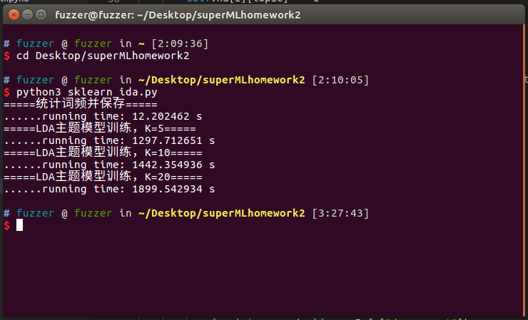
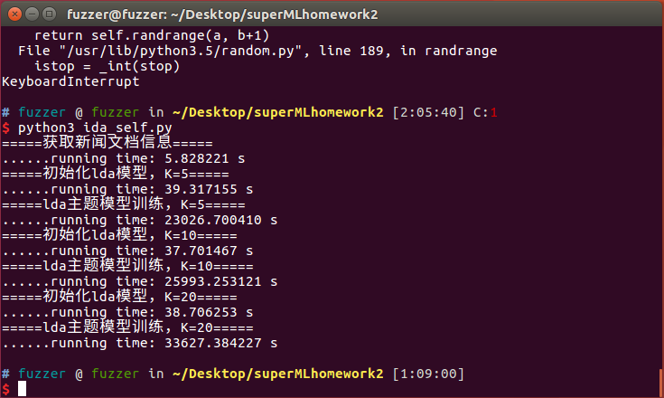

>Delete something about RL_experiment_code

## [LDA](./LDA)
### 运行环境
1. VirtualBox: Ubuntu 16.04 64-bit, 6G RAM
    + 宿主机: Windows10 64-bit, i7-4790 3.6GHz, 4 Core, 16G RAM
2. `Python 3.5.2`, `nltk`, `sklearn`, `numpy`

### 文件说明
1. [`stop_words.txt`](./LDA/stop_words.txt)是停用词表，从网上找来的800+多词和nltk库自带的停用词100+多的结合，去重后共922个。
2. [`news.txt`](./LDA/news.txt)是原始新闻文件，与最初下载的相比，删除了第一行的空行，因此里面其实只有8886条新闻。
3. [`pre_news.txt`](./LDA/pre_news.txt)是预处理后的新闻，处理规则如下：
    + 字母小写化
    + 去标点
    + 去停用词
    + 去带有数字的词
4. [`wordmapid`](./LDA/wordmapid)是词-id映射，规则是根据遍历`pre_news.txt`时每个词第一次出现的次序作为该词的id，例如第一个词是washington则其id为1，第二个为stellar，id为2，以此类推。换言之，该文档的行数即为`pre_news.txt`中词的个数
5. `self/sklearn_lda_K?M?_iter?`是给出K个主题时，LDA模型迭代iter次数后，每个主题下概率最大的M=10个词及其概率的结果。
    + `sklearn`表示调用`sklearn`的LDA模型结果，self表示自己实现的非调库LDA模型结果。
    + `K`表示主题数，取值为`[`[`5`](./LDA/sklearn_lda_K5M10_iter100)`, `[`10`](./LDA/sklearn_lda_K10M10_iter100)`, `[`20`](./LDA/sklearn_lda_K20M10_iter100)`]`
    + `M`表示每个主题下概率最大的M个词，默认`M=10`
    + `iter`默认迭代次数，默认`iter=100`
    + 里面的内容格式为
    ```
    Topic 0:
		word_1 p_1
		word_2 p_2
		...
		word_M p_M
    Topic 1:
		...
      .
      .
      .
    Topic K:
        ...
    ```
6. [tf_vec](./LDA/tf_vec)是使用sklearn生成的词频信息，二进制文件，使用pickle模块读写。
7. [`data_preprocess.py`](./LDA/data_preprocess.py)是预处理数据的py脚本
    + 输入是`news.txt`(即运行py脚本是要求和该文件同一个目录)
    + 输出是`pre_news.txt`和`wordmapid`
8. [`sklearn_lda.py`](./LDA/sklearn_lda.py)是使用sklearn的LDA模型
    + 输入是`pre_news.txt`
    + 输出是`sklearn_lda_K?M?_iter?`，默认生成3个，即`K=[`[`5`](./LDA/sklearn_lda_K5M10_iter100)`, `[`10`](./LDA/sklearn_lda_K10M10_iter100)`, `[`20`](./LDA/sklearn_lda_K20M10_iter100)`]`。
    + 若二进制文件`tf_vec`存在，则会作为该py文件的输入之一，否则会作为输出之一。
    + 运行时间如下：
    
9. [`self_lda.py`](./LDA/self.lda.py)是自己实现的非调库LDA模型
    + 输入是`pre_news.txt`和`wordmapid`
    + 输出是`self_lda_K?M?_iter?`，默认生成3个，即`K=[`[`5`](./LDA/self_lda_K5M10_iter100)`, `[`10`](./LDA/self_lda_K10M10_iter100)`, `[`20`](./LDA/self_lda_K20M10_iter100)`]`。
    + 运行时间如下：
    