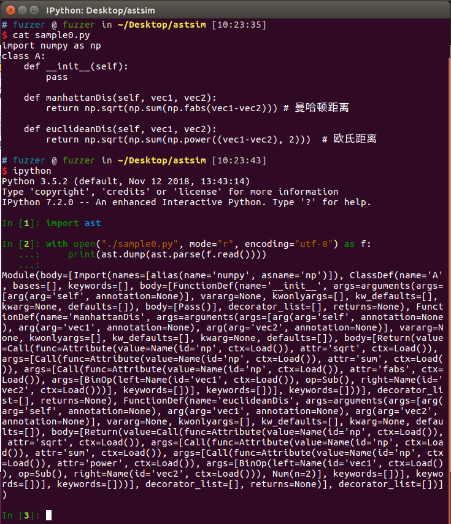
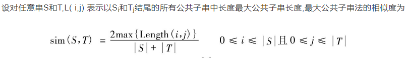
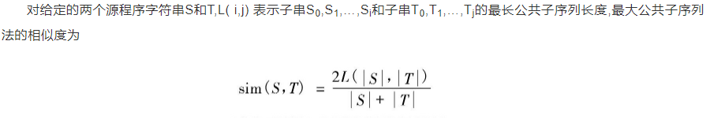
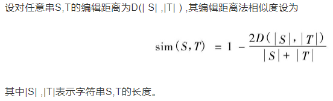
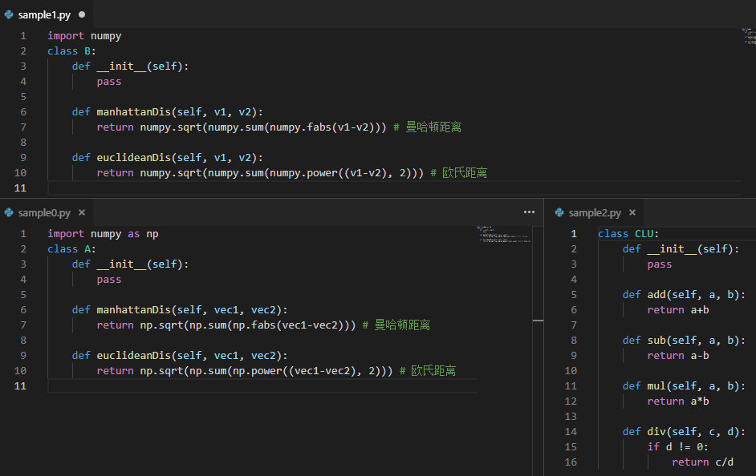
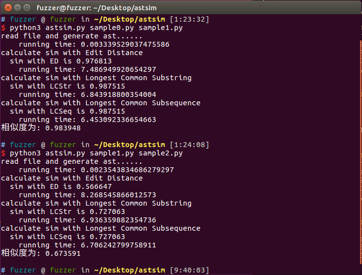
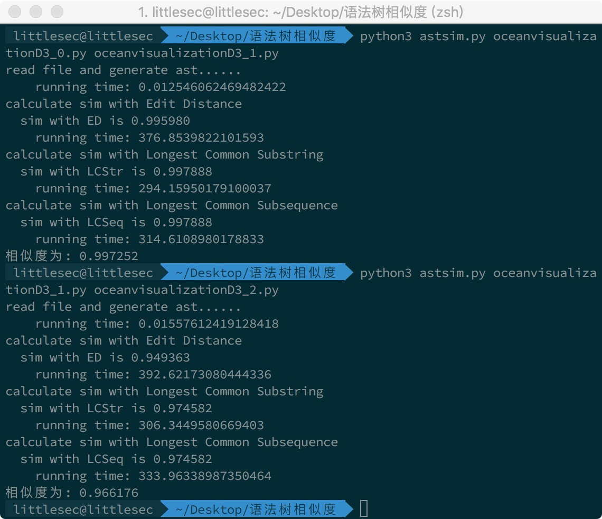

# 软件分析测试 - 作业1 - 实验报告

## 抽象语法树

| 姓名 | 何杰煊 |
| ---- | ---- |
| 学号 | MF1833026 |
| 代码地址 | [GitHub](https://github.com/LittleSec/prospective-master-learning/tree/master/SAT2018_AST_similarity) | 

### 一、研究的问题
完成某一种语言程序的抽象语法树（AST）构造，并能计算任意两棵抽象语法树的相似度。

### 二、评估准则
将得到的ast转化为字符串，使用两ast字符串的相似度作为两个ast之间的相似度。

### 三、实验对象
python3源程序

### 四、实验步骤

#### 抽象语法树的生成
1. 使用python自带的ast模块，读入文件后，将文件内容以字符串类型作为参数传递到函数ast.parse()即可得到分析树的个根节点。
2. ast模块本身自带了一些功能，例如对语法数进行dump操作，还有遍历walk操作。
3. 对语法数进行dump操作后能得到对应抽象语法树的字符串。如下图所示


#### 相似度比较
1. 这里使用三种基于字符串的比较方法：最长公共子串，最长公共子序列，最短编辑距离。参考论文:[基于语法树的程序相似度判定方法](http://kns.cnki.net/KCMS/detail/detail.aspx?dbcode=CJFQ&dbname=CJFD2014&filename=CCYD201401015&uid=WEEvREcwSlJHSldRa1FhdXNXa0d1ZzVNQS8rbXViUjJydHlFRExZMkhYbz0=$9A4hF_YAuvQ5obgVAqNKPCYcEjKensW4IQMovwHtwkF4VYPoHbKxJw!!&v=MjA1Mjc0SDlYTXJvOUVZWVI4ZVgxTHV4WVM3RGgxVDNxVHJXTTFGckNVUkxLZVplUm1GQ25oVWI3S0ppN1Nhckc=)
2. 最长公共子串（Longest-Common-Substring）
    + 暴力求解，递归的方法：
        - 设str_a=<x1,x2,…,xm>和str_b=<y1,y2,…,yn>为两个序列，LCS(str_a,str_b)表示str_a和str_b的一个最长公共子序列，可以看出
        - 如果str_a[m] == str_b[n]，则LCS (str_a, str_b) = str_a[m] + LCS(str_a[1:m-1],str_b[1:n-1])
        - 如果str_a[m] != str_b[n]，则LCS(str_a,str_b)= max{LCS(str_a[1:m-1], str_b), LCS (str_a, str_b[n-1])}
        - LCS问题也具有重叠子问题性质：为找出LCS(str_a,str_b)，可能需要找LCS(str_a[1:m-1], str_b)以及LCS (str_a, str_b[n-1])。但这两个子问题都包含着LCS(str_a[1:m-1],str_b[1:n-1]).
    + 递归的代码
    ```python
    def LCStrRecursive(s1, s2):
        if len(s1) == 0 or len(s2) == 0:
            return 0
        elif s1[0] == s2[0]:
            return LCStrRecursive(s1[1:], s2[1:]) + 1
        else:
            return max(LCStrRecursive(s1[1:], s2), LCStrRecursive(s1, s2[1:]))
    ```
    + 基于自底向上动态规划的方法
    ```python
    def LCStrdp(s1, s2):
        if len(s1) == 0 or len(s2) == 0:
            return 0
        dp = [ [0 for _ in range(len(s2)+1) ] for _ in range(len(s1)+1)]
        for i in range(1, len(s1)+1):
            for j in range(1, len(s2)+1):
                if s1[i-1] == s2[j-1]:
                    dp[i][j] = dp[i-1][j-1] + 1
                else:
                    dp[i][j] = max([dp[i-1][j], dp[i][j-1]])
        return dp[len(s1)][len(s2)]
    ```
    + 相似度计算
3. 最长公共子序列（The Longest Common Subsequence）
    + 最长公共子序列（Longest-Common-Subsequences，LCS）是一个在一个序列集合中（通常为两个序列）用来查找所有序列中最长子序列的问题。这与查找最长公共子串的问题不同的地方是：**子序列不需要在原序列中占用连续的位置**。
    + 算法思路：用动态回归的思想，一个矩阵记录两个字符串中匹配情况，若是匹配则为左上方的值加1，否则为左方和上方的最大值。一个矩阵记录转移方向，然后根据转移方向，回溯找到最长子序列。
    ```python
    def LCSeq(s1, s2): 
        # 生成字符串长度加1的0矩阵，m用来保存对应位置匹配的结果
        m = [ [ 0 for _ in range(len(s2)+1) ] for _ in range(len(s1)+1) ] 
        # d用来记录转移方向
        d = [ [ None for _ in range(len(s2)+1) ] for _ in range(len(s1)+1) ] 
        ok, left, up = 0, -1, 1
        for p1 in range(len(s1)): 
            for p2 in range(len(s2)): 
                if s1[p1] == s2[p2]:            # 字符匹配成功，则该位置的值为左上方的值加1
                    m[p1+1][p2+1] = m[p1][p2]+1
                    d[p1+1][p2+1] = ok
                elif m[p1+1][p2] > m[p1][p2+1]:  # 左值大于上值，则该位置的值为左值，并标记回溯时的方向
                    m[p1+1][p2+1] = m[p1+1][p2] 
                    d[p1+1][p2+1] = left
                else:                           # 上值大于左值，则该位置的值为上值，并标记方向up
                    m[p1+1][p2+1] = m[p1][p2+1]   
                    d[p1+1][p2+1] = up      
        p1, p2 = len(s1), len(s2)
        s = [] 
        while m[p1][p2]:    # 不为None时
            c = d[p1][p2]
            if c == ok:   # 匹配成功，插入该字符，并向左上角找下一个
                s.append(s1[p1-1])
                p1-=1
                p2-=1 
            elif c == left:  # 根据标记，向左找下一个
                p2 -= 1
            elif c == up:   # 根据标记，向上找下一个
                p1 -= 1
        # s.reverse() 
        return(len(s))
    ```
    + 相似度计算
4. 编辑距离法(ED: Edit Distance)
    + 又称Levenshtein距离，指两个字串之间，由一个转成另一个所需的最少编辑操作次数。其中编辑操作包括将一个字符替换成另一个字符，插入一个字符，删除一个字符。
    + 算法思想：动态规划，状态: edit(i, j)，表示第一个字符串的长度为i的子串到第二个字符串的长度为j的子串的编辑距离。
    + 状态转移方程:
        - if i == 0 且 j == 0，edit(i, j) = 0
        - if i == 0 且 j > 0，edit(i, j) = j
        - if i > 0 且 j == 0，edit(i, j) = i
        - if i ≥ 1  且 j ≥ 1 ，edit(i, j) == min{ edit(i-1, j) + 1, edit(i, j-1) + 1, edit(i-1, j-1) + f(i, j) }，当第一个字符串的第i个字符不等于第二个字符串的第j个字符时，f(i, j) = 1；否则，f(i, j) = 0。
    ```python
    def EditDistance(word1, word2):
        word1 = ' ' + word1
        word2 = ' ' + word2
        target = [['' for _ in range(len(word2))] for _ in range(len(word1))]
        for i in range(len(word1)):
            target[i][0] = i
        for j in range(len(word2)):
            target[0][j] = j
        for i in range(1, len(word1)):
            for j in range(1, len(word2)):
                if word1[i] != word2[j]:
                    target[i][j] = min(target[i-1][j] + 1, target[i][j-1] + 1, target[i-1][j-1] + 1)
                else:
                    target[i][j] = min(target[i-1][j] + 1, target[i][j-1] + 1, target[i-1][j-1])
                # print('target[%d][%d]'%(i, j),target[i][j])
        return target[len(word1) - 1][len(word2) - 1]
    ```
    + 相似度计算

### 五、实验结果
#### 实验程序
1. 为了演示，写了三个示例程序，分别是`sample0.py`,`sample1.py`和`sample2.py`，如下图所示。
    + 
2. 其中`sample0.py`和`sample1.py`都是一个计算曼哈顿距离和欧氏距离的类，使用了numpy库，但是他们的**类名不一样**，而且对numpy的**使用声明也不一样**，前者设置了别名，后者没有设置别名。
    + 正常情况下，这两者个程序的**相似度应该很高**，因为只是变量名不同而已，程序逻辑和代码结构是一样的。
3. 而`sample2.py`是一个简单的运算类，包含加减乘除四个成员函数
    + 其功能和结构明显与`sample0.py`,`sample1.py`不同，**相似度应该很低**。

#### 实验结果
实验结果如图，输出包括三种相似度计算的时间和结果，结果符合上述说明。


### 六、讨论
1. 对python而言，直接把代码当成字符串和把其ast转换成字符串，两者是不一样的，因为python是通过缩进来识别代码块的，而且不同编程人员的编码风格不一致，有些缩进是\t，有些是space，这样就会引入意想不到的“空白”导致使用字符串判定相似度的方法误差很大，而且注释也能引入很大的误差。转成ast后，这些问题就能通通解决。而且ast的字符串形式统一，对于如果仅仅是改了变量名的代码而言，字符串计算相似度的方法也很有效，因为在ast里没有注释，而且对于同样的逻辑结构会有同样的字符串格式，能保证最小化因为编码风格不同引入的字符串形式不一致问题。
2. 然而将程序转换成ast，再将ast转换成字符串，本省也引入了不少无关字符串，从抽象语法树的字符串截图中可以看出，这对基于字符串的相似度比较算法而言，很消耗内存和性能。下图是一个较为长的代码例子：
    + 代码来源于本人[本科毕业设计](https://github.com/LittleSec/OceanVisualizationD3)的项目中的`hello.py`，当然进行了一定的删减，来自不同分支和不同历史commit的同一个文件。由于代码过长，在此不进行展示。
        - `oceanvisualizationD3_0.py`来自于Branch: release-branch
        - `oceanvisualizationD3_1.py`来自于Branch: release-branch，与0相比修改了变量名以及把list类型换成了tuple
        - `oceanvisualizationD3_2.py`来自于Branch: master，多了一些全局变量
    + 理论上来说，这几个文件的相似度应该很高。
    + 运行结果如图所示。可以看出0和1的相似度较高，而1和2的相似度稍微低一些，毕竟是来自不同的分支，这符合预期。当时release-branch是删减了一些master调试代码，主要算法是没变的，因此相似度也不会太低。
    
3. 通过上述描述可以知道对于上百行的python代码而言，运行时间就无法让人接受了。因此基于ast字符串相似度的比较方法其实并不是使用。
4. 一个解决思路是根据节点的不同属性，计算每个节点的向量，通过向量的比较和运算来计算ast的相似度。这在一开始提到的论文引用中有介绍。这也是下一步可以做的工作。